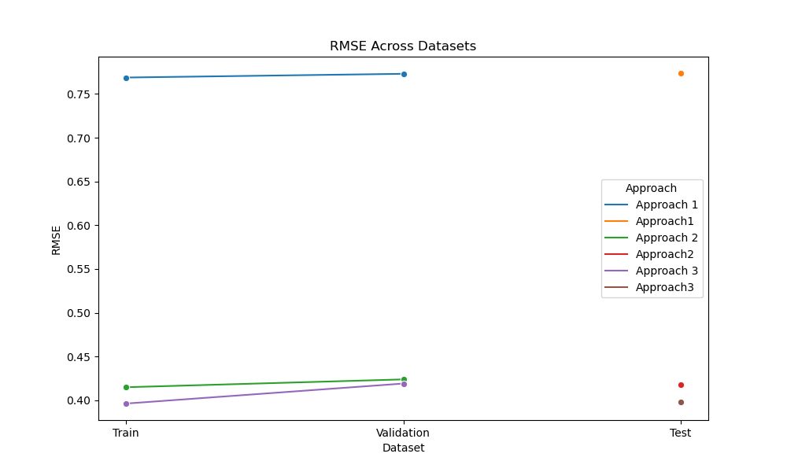
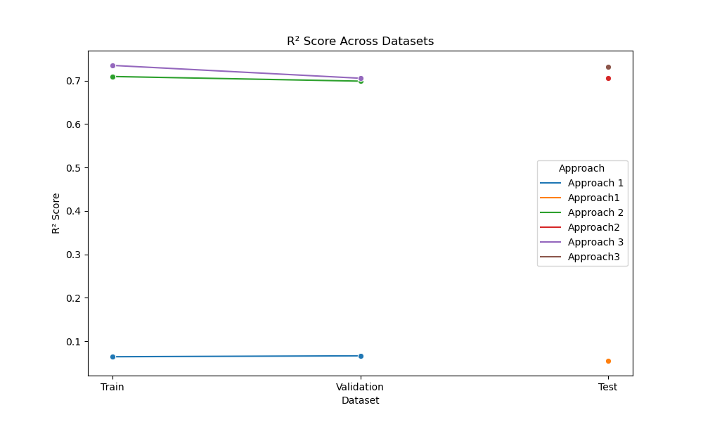

# Trip Duration Prediction Using New York Taxi Dataset

## Project Overview
This project aims to predict the trip duration of New York City taxi rides using the New York taxi dataset from Kaggle ( A variation of it, provided its source down in the aknowledgements ). The primary objective is to maximize the R² score without altering the baseline model architecture. I used Ridge regression with a fixed alpha of 1 across all approaches.

## Dataset
The dataset used in this project is a variation based on the New York City taxi dataset, available on Kaggle. [Kaggle Dataset Link](https://www.kaggle.com/competitions/nyc-taxi-trip-duration)

### Original Features
The dataset originally included the following features:

- **id**, **vendor_id**, **pickup_datetime**, **dropoff_datetime**
- **passenger_count**, **pickup_longitude**, **pickup_latitude**
- **dropoff_longitude**, **dropoff_latitude**, **store_and_fwd_flag**
- **trip_duration** (target feature)

For the baseline model, I focused on a subset of these features.

## Approaches
I implemented three distinct approaches to achieve the prediction:

1. **Basic Feature Training**
   - Trained the model with a selected subset of original features: `pickup_longitude`, `pickup_latitude`, `dropoff_longitude`, `dropoff_latitude`, and `passenger_count`. I also derived temporal features from `pickup_datetime`, splitting it into `dayofweek`, `month`, `hour`, and `dayofyear`.
   
2. **Feature Engineering**
   - Introduced new features to capture trip characteristics more effectively. These additional features played a significant role in improving model performance:
     - **haversine_distance**: Approximate distance between pickup and dropoff points.
     - **bearing_angle**, **bearing_sin**, **bearing_cos**: Bearing angle between pickup and dropoff, helping the model consider trip direction.
     - **bearing_hour_interaction**, **bearing_dayofweek_interaction**: Captured patterns between trip direction and temporal features.
     - **is_rush_hour**, **is_daytime**, **is_weekend**: Temporal flags to represent different traffic conditions.
     - **rolling_mean_duration_by_hour**: Hourly mean trip duration for temporal smoothing.
     - **distance_hour_interaction**, **passenger_rush_interaction**: Cross features capturing interactions of time and distance with passenger and rush-hour data.
     - **log_haversine_distance**, **distance_bucket**: Log-transformed and bucketed distance, helping the model handle skewed distances effectively.

3. **Polynomial Regression**
   - Extended the second approach by applying polynomial regression with a degree of 2 on numerical features. This allowed the model to capture non-linear relationships more accurately, further improving its predictive capabilities.

## Results
For each approach, I calculated the Root Mean Squared Error (RMSE) and R² scores for the training, validation, and test datasets. The results are summarized below:

**Note: these results is based on the whole Data which is not presented in this repo. ( just a sample of it provided to try models if wanted )**

| Approach               | Train RMSE | Validation RMSE | Test RMSE | Train R² | Validation R² | Test R² |
|------------------------|------------|-----------------|-----------|----------|---------------|---------|
| Basic Feature Training | 0.7688     | 0.7730          | 0.7738    | 0.0642   | 0.0663        | 0.0548  |
| Feature Engineering    | 0.4195     | 0.4282          | 0.4218    | 0.7030   | 0.6925        | 0.6990  |
| Polynomial Regression  | 0.3971     | 0.4196          | 0.3992    | 0.7339   | 0.7049        | 0.7303  |

## Visualizations
To illustrate the performance differences across approaches, I created two plots:

1. **RMSE Comparison**
   - 

2. **R² Score Comparison**
   - 

## Conclusion
The introduction of engineered features like `haversine_distance` with its log, `distance_bucket`, `distance_hour_interaction`, and interaction terms significantly improved the model’s ability to capture trip duration nuances. Applying polynomial regression further boosted performance, demonstrating the value of feature engineering and transformation in predictive modeling.

**Note: In this project, boosted techniques and random forests, which often yield higher performance on a tabular data like this, were intentionally not used. Instead, the focus was on enhancing model performance through data-driven improvements, specifically through feature engineering. The goal was to maximize the predictive power by refining the features rather than altering the model architecture, demonstrating the impact of data representation on prediction accuracy.**

## Acknowledgments
- [Kaggle]([https://www.kaggle.com/](https://www.kaggle.com/competitions/nyc-taxi-trip-duration)) for providing the dataset.
- Actual data used in this project is a variation of the Kaggle dataset, made by **Dr. Mustafa Saad** , and was introduced first in his ML Course.
